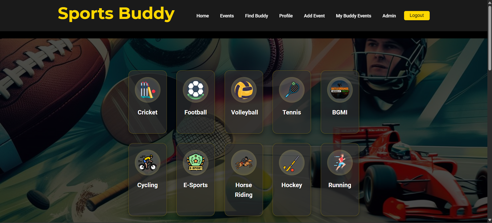

# 🏅 Sports Buddy

### 🔗 [Live Demo](https://sport-buddy-daee1.web.app/)

## Find Your Perfect Sports Partner & Events!



**Sports Buddy** is a dynamic web application designed to connect sports enthusiasts. Whether you're looking for a casual game, a training partner, or exciting local sports events, **Sports Buddy** helps you discover, join, and organize sporting events effortlessly.

---

## ✨ Features

- 🎯 **Browse Sports Categories** – Filter events and find buddies based on your preferred sport (Football, Cricket, Volleyball, E-Sports, etc.).
- 📆 **Discover Upcoming Events** – View and explore live sports events in your location.
- ✅ **Join / Leave Events** – Manage your participation in events easily.
- 📝 **Create Your Own Events** – Organize and host games, tournaments, and meetups.
- 🧑‍🤝‍🧑 **Find Buddies** – Connect with people who love the same sports.
- 👤 **User Profiles** – Manage personal details and event history.
- 🔐 **Authentication** – Secure login and registration with Firebase Auth.
- 🛠 **Admin Dashboard (Beta)** – Modular dashboard for restricted user(s) like `admin@sportsbuddy.com`.
- 📱 **Responsive Design** – Mobile-friendly and works across all devices.
- 🔔 **Real-time Notifications** – For logins, RSVP actions, and updates.
- 🧭 **Smooth UI Navigation** – Auto-scroll to selected sports sections on the home page.

---

## 🚀 Technologies Used

### ⚛ Frontend
- **React.js**
- **React Router DOM**
- **HTML**
- **CSS**
- **Vite.js**

### ☁ Backend & Database
- **Firebase**
  - 🧾 **Authentication**
  - 🔥 **Firestore Database**
  - ⚙️ (config via `.env.local`)

---

## ⚙️ Setup & Installation

### ✅ Prerequisites

- Node.js (LTS)
- npm or Yarn

---

### 🧩 1. Clone the Repository

```
    git clone https://github.com/Mr-aj33t/Sports_Buddy_App.git
    cd Sports_Buddy_App
```


---

### 📦 2. Install Dependencies

```
    npm install
    OR
    yarn install
```


---

### 🔐 3. Firebase Configuration

1. Go to the [Firebase Console](https://console.firebase.google.com/)
2. Create a new project and web app
3. Copy your config object:

```
    const firebaseConfig = {
    apiKey: "YOUR_API_KEY",
    authDomain: "YOUR_AUTH_DOMAIN",
    projectId: "YOUR_PROJECT_ID",
    storageBucket: "YOUR_STORAGE_BUCKET",
    messagingSenderId: "YOUR_MESSAGING_SENDER_ID",
    appId: "YOUR_APP_ID"
    };
```


4. Create a file called `.env.local` in the root of your project and paste your config like:

```
    REACT_APP_FIREBASE_API_KEY="YOUR_API_KEY"
    REACT_APP_FIREBASE_AUTH_DOMAIN="YOUR_AUTH_DOMAIN"
    REACT_APP_FIREBASE_PROJECT_ID="YOUR_PROJECT_ID"
    REACT_APP_FIREBASE_STORAGE_BUCKET="YOUR_STORAGE_BUCKET"
    REACT_APP_FIREBASE_MESSAGING_SENDER_ID="YOUR_MESSAGING_SENDER_ID"
    REACT_APP_FIREBASE_APP_ID="YOUR_APP_ID"
```

5. 🧯 Enable Firestore & Email/Password Auth in your Firebase console

---

### ▶️ 4. Run the App Locally

```
    npm run dev
    OR
    yarn dev
```


Then open: http://localhost:5173/

---

## 🗂️ Project Structure

```
        Sports_Buddy_App/
    ├── public/
    │ ├── assets/
    │ └── index.html
    ├── src/
    │ ├── components/
    │ ├── firebase/
    │ ├── pages/
    │ ├── App.jsx
    │ ├── App.css
    │ └── main.jsx
    ├── .env.local
    ├── .gitignore
    ├── vite.config.js
    ├── package.json
    └── README.md
```

## 📄 License

This project is licensed under the [MIT License](https://opensource.org/licenses/MIT)

---

## 📧 Contact

Developed by [AJ (Mr-aj33t)](https://github.com/Mr-aj33t)  
Feel free to reach out via GitHub with suggestions or questions.

---

